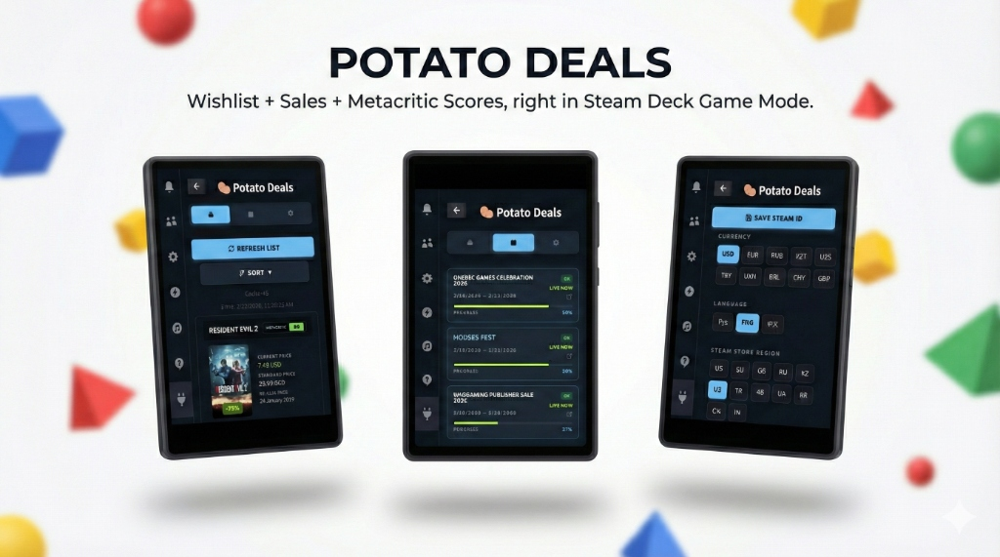

# Potato Deals 🥔

**Potato Deals** is a Decky Loader plugin built specifically for Steam Deck Game Mode. It helps you track what matters most in your Steam Wishlist - prices, discounts, ratings, and active sales - without leaving the Deck UI.

### 📥 [Download Latest Version (v3.1.14)](https://github.com/openanton/potato-deals/raw/main/potato-deals-v3.1.14.zip)

Designed for the way people actually use Steam Deck: quick browsing, fast decisions, and clean UI. It stays lightweight, works inside Game Mode, and keeps everything one tap away.

## 🌟 Features

-   **Wishlist Viewer in Game Mode** - Browse your Steam Wishlist directly on Steam Deck.
-   **Powerful Sorting**:
    -   By discount size
    -   By Metacritic score
    -   By price (low → high / high → low)
    -   By alphabet (A → Z)
    -   By date added
-   **Regional Store Awareness** - Shows prices and active sales for your Steam account store region (with support for manual override when needed).
-   **Sales Tracker** - View ongoing Steam events/sales and track their progress (time elapsed from start to end).

## 🚀 Installation

1.  Open **Decky Loader** on your Steam Deck.
2.  Navigate to **Settings** -> **Developer**.
3.  Choose **Install from ZIP**.
4.  Provide the link to the latest release `.zip` file from the [Releases](https://github.com/openanton/potato-deals/releases) page (or download and select it manually).

## 🔄 Updates & Uninstallation

-   **Update**: Download the latest version from GitHub and repeat the installation steps.
-   **Uninstall**: Use the Decky Loader plugin manager to remove Potato Deals.

## 📝 Known Limitations

-   Regional prices depend on the currency configuration in plugin settings.
-   Requires an active internet connection to fetch real-time data.

## 📄 License

This project is licensed under the GPL-3.0 License - see the [LICENSE](LICENSE) file for details.

---
*Built with ❤️ for the Steam Deck community.*
